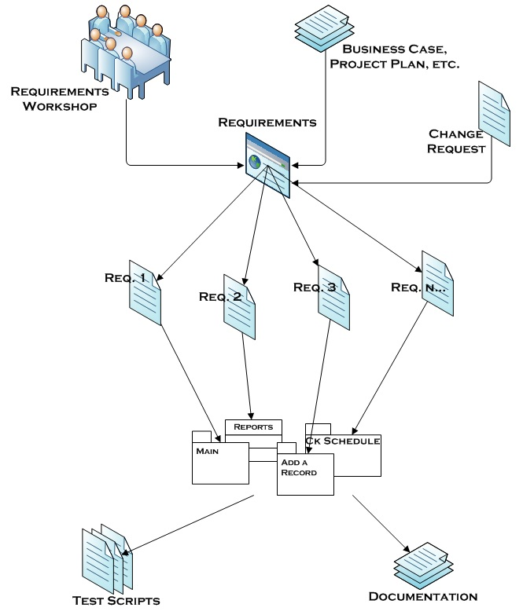

## Safety Requirements and Traceability

Safety engineering becomes actionable when hazards are turned into **clear safety requirements** and you can show, later, that those requirements were **implemented, verified, and remain valid after change**. Most safety standards treat this as a core discipline: requirements must be well-formed and traceable, and lifecycle evidence must be maintainable under change. ([drkasbokar.com][1])

[Wiki](https://upload.wikimedia.org/wikipedia/commons/6/69/RequirementsTraceability.jpg)
---

### Writing good safety requirements

A “good” requirement is not just “clear”—it must be **testable and traceable**. Requirements-engineering guidance (e.g., ISO/IEC/IEEE 29148) commonly emphasizes characteristics like unambiguous, singular, feasible, verifiable, and traceable. ([drkasbokar.com][1])

For **safety requirements**, add a few practical constraints that matter in real systems:

* **Specific and bounded**

  * Define *what must (not) happen* and *in what conditions* (modes, states, inputs).
  * Avoid “as soon as possible”, “should”, “robust”, “safe enough”.

* **Testable (verification-friendly)**

  * Include observable acceptance criteria: thresholds, time limits, detectable events, logs, fault codes, coverage targets where appropriate.
  * Example: “Within 100 ms of detecting loss of valid position input, the controller shall…”.

* **Measurable**

  * Prefer quantitative terms: timing, limits, rate, maximum energy, max commanded output, detection latency, retry counts.

* **Assumption-aware**

  * Safety cases and safety arguments explicitly capture **assumptions and context** and link them to evidence; requirements should do the same. ( [2])
  * Pattern:

    * “**Under assumption A**, the system shall do X.”
    * “**If assumption A is violated**, the system shall detect it and transition to Y (safe state).”

* **Minimal design bias (but not dogmatic)**

  * Prefer *what* over *how*, but allow mandated mechanisms when they are part of the safety strategy (e.g., “independent watchdog shall…”, “two-channel comparison shall…”).

**Useful templates**

* **Safety constraint (prohibition):** “The system shall not …”
* **Safety function (active control):** “The system shall detect … and respond by …”
* **Safe-state requirement:** “On [condition], the system shall enter [safe state] within [time] and remain until [reset condition].”
* **Diagnostic requirement:** “The system shall detect [fault] with [coverage/criteria] and report [code] within [time].”

---

### Deriving requirements from hazards

Hazard analysis produces hazards/hazardous scenarios; requirements turn those into **constraints and controls**. A common systems-theoretic framing (STPA) explicitly includes defining **system-level safety constraints** and refining them into more detailed constraints as you analyze unsafe control actions and causal scenarios. ([ScienceDirect][3])

A practical derivation chain (works with FMEA/FTA/STPA-style inputs):

1. **Hazard / hazardous scenario**

   * “Uncommanded actuator motion while maintenance mode is active.”

2. **Safety constraint (system-level)**

   * “The system shall not command actuator motion in maintenance mode.”

3. **Safety function(s) (how the system enforces the constraint)**

   * “The system shall inhibit actuator commands when maintenance mode is active.”
   * “The system shall detect conflicting mode signals and enter safe state.”

4. **Allocated (derived) software requirements**

   * Mode manager, command gate, interlocks, plausibility checks, timeout behavior.
   * Include assumptions: sensor validity, comms integrity, operator actions.

5. **Verification requirements**

   * Requirements-based tests, fault-injection tests, reviews/analysis activities, and acceptance criteria.

This is the key idea: **hazards don’t directly become code tasks**. They become **constraints and safety functions** that you can specify, implement, and verify.

---

### Traceability

#### Hazard ↔ requirement ↔ design ↔ code ↔ tests ↔ evidence

Safety-oriented standards commonly expect **bidirectional traceability**: you can trace forward from hazards/requirements to code/tests and trace backward from code/tests to the requirements they satisfy (and ultimately to hazards). ([arc42 Quality Model][4])

A concrete way to think about it is as an “evidence graph”:

* **Hazards** (hazard log / HARA outputs)
  ↔
* **Safety requirements** (constraints, functions, safe-state behavior)
  ↔
* **Design artifacts** (architecture decisions, interfaces, independence boundaries)
  ↔
* **Code** (modules/functions/config implementing requirements)
  ↔
* **Tests** (requirements-based tests, robustness/fault injection)
  ↔
* **Evidence** (test reports, coverage, review records, analysis results)

Many real certification packages explicitly use traceability matrices linking system safety requirements through architecture/design down to validation tests. ([emerson.com][5])

#### Minimal traceability that still works for small teams

You do not need heavyweight tools to get most of the value. A minimal setup:

* **Hazard Log** with unique IDs (HZ-001…)
* **Safety Requirements** with unique IDs (SR-001…) and links to hazards
* **Design notes** (architecture decision records / interface specs) linked from SRs
* **Code tags**: reference SR IDs in code (comments, docstrings) and/or commit messages
* **Tests** named/tagged by SR IDs, producing stored test reports
* **Evidence folder** per release: test results, review checklist output, static analysis summary, build metadata

Minimal “traceability matrix” fields that are usually enough:

* Hazard ID(s)
* Safety requirement ID
* Design element(s) (module/interface/ADR)
* Code location(s) (repo path, component)
* Test case ID(s)
* Evidence pointer(s) (report link, CI artifact, review record)

Automate what you can:

* Enforce “SR-ID required” in PR templates / commit messages.
* Generate an RTM from test metadata + code annotations.
* Store evidence as versioned artifacts tied to a release/build.

#### V-model as a traceability shortcut (why requirements must be testable)

[V model, Wiki](https://upload.wikimedia.org/wikipedia/commons/f/f9/V-model.svg)

The V-model is often shown as a “development vs testing” diagram, but the useful safety takeaway is simpler: it highlights that every artifact you produce on the left must be matched by verification evidence on the right. System-level requirements are verified by system-level tests; component/interface designs are verified by integration tests; and detailed software designs and code are verified by unit tests and static analysis.
For safety work, the V-model is a reminder to write requirements in a way that allows a clear verification method (test, analysis, inspection, or demonstration) and to keep links from those verification results back to the requirement (and, ultimately, to the hazard it controls). This turns “we think it’s safe” into an auditable chain: **hazard → safety requirement → implementation/design choice → verification results → stored evidence**.
When changes occur, the same mapping provides a practical change-impact rule: if you modify something on the left (requirements/design/code), you must revisit the corresponding items on the right (tests/analysis and their reports) that serve as evidence.
---

### Change impact analysis

Change impact analysis is the discipline of deciding **what safety claims and evidence are invalidated by a change**. It is widely treated as necessary in safety contexts, and guidance exists specifically on change impact analysis as required by safety standards. ([SINTEF][6])

A practical approach is to classify changes and map them to evidence that must be revisited:

#### 1) Requirements / hazard changes

Examples:

* New hazard, updated severity, changed operational assumptions (ODD), new misuse case.

Likely invalidates:

* Hazard analysis outputs, derived safety requirements, safety argument/claims, validation scope.

#### 2) Design / architecture changes

Examples:

* New component split/merge, changed interfaces, reduced independence, new communications path.

Likely invalidates:

* Safety requirement allocation, interface constraints, integration tests, independence arguments, some reviews/analyses.

#### 3) Code changes

Examples:

* Logic changes in safety mechanisms, timing changes, concurrency changes, error handling changes.

Likely invalidates:

* Unit tests for affected SRs, integration/robustness tests, code review evidence, coverage evidence, static-analysis baselines.

#### 4) Toolchain / environment changes

Examples:

* Compiler version, code generator, static analysis tool configuration, CI pipeline change, hardware revision.

Likely invalidates:

* Build reproducibility evidence, some test results, tool qualification assumptions (if applicable), performance/timing evidence.

#### 5) Configuration / data / operational changes

Examples:

* Parameter sets, calibration, feature flags, deployment scripts, monitoring rules.

Likely invalidates:

* Assumptions in safety requirements, operational mitigations, runtime monitoring effectiveness, incident response playbooks.

**A useful rule:** if a change affects an artifact that a safety claim depends on, you either (a) re-run the dependent verification activities, or (b) justify why the evidence still applies (with documented rationale).

To keep this manageable, use the trace links: start from the changed item (code, config, interface, requirement) → traverse to the related SRs → traverse to tests and other evidence → re-validate exactly that slice.

[1]: https://drkasbokar.com/wp-content/uploads/2024/09/29148-2018-ISOIECIEEE.pdf?utm_source=chatgpt.com "international standard iso/iec/ ieee 29148"
[2]: https://www.faa.gov/about/office_org/headquarters_offices/ang/redac/redac-sas-201503-nasa-safety-case-patterns.pdf?utm_source=chatgpt.com "Safety Case Patterns: Theory and Applications"
[3]: https://www.sciencedirect.com/science/article/abs/pii/S0925753521004082?utm_source=chatgpt.com "The past and present of System-Theoretic Accident Model ..."
[4]: https://quality.arc42.org/standards/do-178c?utm_source=chatgpt.com "DO-178C - Software Considerations in Airborne Systems ..."
[5]: https://www.emerson.com/documents/automation/functional-safety-certificate-iec-61508-assessment-en-6004984.pdf?utm_source=chatgpt.com "functional-safety-certificate-iec-61508-assessment-en- ..."
[6]: https://www.sintef.no/globalassets/_div.-opprydding-2023/change-impact-analysis-and-safescrum_psam12.pdf?utm_source=chatgpt.com "Change Impact Analysis as required by safety standards, ..."
