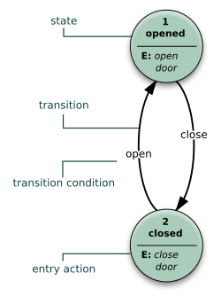

## Defensive Coding for Safety

Defensive coding (for safety) is the practice of designing and implementing software so that faults—whether from your own code, other components, hardware/sensors, operators, or unexpected environments—are detected early and handled in a way that prevents hazards or drives the system to a defined safe behavior. NASA’s software safety guidance frames defensive programming as “methods, techniques, and algorithms designed to prevent faults from becoming failures,” and emphasizes planning a consistent strategy rather than “tacking it on later.” ([s3vi.ndc.nasa.gov][1])

What follows are practical, implementable patterns for software developers, mapped to common accident causes: invalid inputs, ambiguous state, silent errors, resource exhaustion, numeric/units mistakes, concurrency failures, and configuration drift.

---

### Input validation and sanitization

**Safety goal:** prevent invalid or unexpected inputs from propagating into control logic, estimators, planners, or actuators.

**Key practices**

* **Treat all external data as untrusted**: user commands, network messages, config files, sensor values, inter-process messages (including “internal” producers that can fail). NASA explicitly calls out other programs, hardware faults, and operator errors as sources of “anything thrown at it.” ([s3vi.ndc.nasa.gov][1])
* **Validate early and locally** (closest to the boundary): reject/contain bad inputs before they hit state estimation or control.
* **Separate two validation levels**:

  * **Syntactic validation**: type/shape/range/format.
  * **Semantic validation**: consistency with system context (“start < end”, “speed consistent with mode”, “GPS fix quality acceptable”).
    OWASP summarizes this split and recommends validating as early as possible to prevent malformed data from triggering downstream malfunctions. ([cheatsheetseries.owasp.org][2])
* **Prefer allow-lists to deny-lists** for enumerated values (modes, message types, command IDs).
* **Sanitization** is context-specific (e.g., escaping for logs/HTML/SQL). For safety, sanitization is often secondary to **rejecting** malformed control-relevant inputs.

**Python example: boundary validator**

```python
from dataclasses import dataclass
from enum import Enum
from math import isfinite

class Mode(Enum):
    MANUAL = "manual"
    AUTO = "auto"
    RTL = "rtl"

@dataclass(frozen=True)
class Command:
    mode: Mode
    target_alt_m: float  # meters
    max_speed_mps: float

def parse_and_validate(payload: dict) -> Command:
    # Syntactic checks
    if "mode" not in payload:
        raise ValueError("missing mode")
    try:
        mode = Mode(payload["mode"])
    except Exception as e:
        raise ValueError(f"invalid mode: {payload['mode']}") from e

    target_alt_m = float(payload.get("target_alt_m", 0.0))
    max_speed_mps = float(payload.get("max_speed_mps", 0.0))

    if not (isfinite(target_alt_m) and isfinite(max_speed_mps)):
        raise ValueError("non-finite numeric input")

    # Range checks (example bounds; make these explicit per system/ODD)
    if not (0.0 <= target_alt_m <= 120.0):
        raise ValueError("target_alt_m out of bounds")
    if not (0.0 < max_speed_mps <= 20.0):
        raise ValueError("max_speed_mps out of bounds")

    # Semantic checks
    if mode == Mode.MANUAL and target_alt_m != 0.0:
        raise ValueError("manual mode must not accept target altitude")

    return Command(mode=mode, target_alt_m=target_alt_m, max_speed_mps=max_speed_mps)
```

---

### Explicit state machines: illegal states unrepresentable, invariants

  
[FSM example, wiki](https://commons.wikimedia.org/wiki/File%3AFinite_state_machine_example_with_comments.svg?utm_source=chatgpt.com)  
**Safety goal:** ensure control logic cannot enter ambiguous or contradictory states, and transitions are controlled, auditable, and testable.

**Key practices**

* **Use explicit state machines** for modes and safety-relevant sequences (arming, takeoff, mission, landing, degraded modes, recovery).
* **Make illegal states unrepresentable** where practical:

  * Use enums + typed structures per state (instead of “mode + a bag of optional fields”).
  * Split responsibilities: state = “truth,” commands/events = “requests.”
* **Enforce invariants** at state boundaries:

  * Preconditions for transitions (guards).
  * Postconditions after transitions (invariants).
* **“Come-from” / authorization checks** (a defensive technique described in NASA guidance): critical routines verify that required preceding steps have occurred before executing. ([s3vi.ndc.nasa.gov][1])

**Python pattern: state-typed data + guarded transitions**

```python
from dataclasses import dataclass
from enum import Enum, auto

class StateTag(Enum):
    DISARMED = auto()
    ARMED = auto()
    IN_FLIGHT = auto()
    FAILSAFE = auto()

@dataclass(frozen=True)
class Disarmed:
    tag: StateTag = StateTag.DISARMED

@dataclass(frozen=True)
class Armed:
    tag: StateTag = StateTag.ARMED
    home_set: bool = True

@dataclass(frozen=True)
class InFlight:
    tag: StateTag = StateTag.IN_FLIGHT
    altitude_m: float = 0.0

@dataclass(frozen=True)
class Failsafe:
    tag: StateTag = StateTag.FAILSAFE
    reason: str = "unknown"

def arm(s: Disarmed) -> Armed:
    # preconditions
    return Armed(home_set=True)

def takeoff(s: Armed, target_alt_m: float) -> InFlight:
    if not s.home_set:
        return Failsafe(reason="home_not_set")
    if not (0.0 < target_alt_m <= 120.0):
        return Failsafe(reason="bad_target_alt")
    return InFlight(altitude_m=target_alt_m)
```

---

### Error handling policy: no silent failures, structured propagation, fail-closed vs fail-open

**Safety goal:** ensure errors are detected, surfaced, and handled deterministically, with clear decisions about what happens when the system is uncertain.

**Key practices**

* **Define a project-wide error-handling policy** (what to return/raise/log, when to retry, when to stop, when to enter a safe mode). NASA emphasizes deciding early whether functions validate inputs themselves or rely on callers, and stresses consistency across modules. ([s3vi.ndc.nasa.gov][1])
* **No silent failures**:

  * Avoid “defaulting” without recording it (especially for safety signals).
  * Avoid in-band error indicators that can be confused with valid data (CERT explicitly recommends avoiding in-band error indicators and adopting a comprehensive policy). ([wiki.sei.cmu.edu][3])
* **Structured propagation**:

  * Use explicit `Result`-like returns at safety boundaries, or exceptions with a single boundary that converts them into safe actions.
  * Preserve root cause (error chaining) for diagnostics.
* **Fail-closed vs fail-open is a design decision**:

  * *Fail-closed* (deny/stop) is usually safer when uncertain action could cause harm.
  * *Fail-open* (continue) may be appropriate if stopping creates a greater hazard (e.g., steering assist dropout in traffic), but must be justified and bounded.
    NIST describes “secure defaults” as restrictive, conservative behavior that follows “deny unless explicitly authorized,” and notes that if initialization fails, the system either performs operations using secure defaults or does not perform the operation. ([NIST  ][4])

**Practical rule:** if you ever “continue anyway,” make it an explicit branch with logging/telemetry and (ideally) a degraded mode.

---

### Resource management: memory, file descriptors, GPU/CPU budget, queues/backpressure

**Safety goal:** prevent resource exhaustion and timing collapse from cascading into unsafe behavior.

**Key practices**

* **Bound everything that can grow**: queues, caches, logs, buffers, retry loops.
* **Prefer allocation at initialization** for safety-critical loops. Holzmann’s “Power of 10” rules for safety-critical code include: *no dynamic memory allocation after initialization*, motivated by unpredictability and common classes of allocation/free errors. 
* **Bound execution**:

  * Fixed upper bounds on loops (or enforced max iterations) to prevent runaway code. 
  * Timeouts on blocking calls (I/O, locks, IPC).
* **Backpressure policy** for queues:

  * Block with timeout (apply backpressure).
  * Drop oldest / drop newest (and record it).
  * Degrade: reduce rate, reduce fidelity, disable non-critical features.

**Python example: bounded queue with explicit drop policy**

```python
import queue
import time
from dataclasses import dataclass

@dataclass
class Sample:
    t: float
    value: float

q = queue.Queue(maxsize=200)

def push_sample(s: Sample) -> bool:
    try:
        q.put(s, timeout=0.01)  # bounded wait
        return True
    except queue.Full:
        # Explicit policy: drop and count/telemetry
        return False

def consumer_loop():
    while True:
        try:
            s = q.get(timeout=0.1)
        except queue.Empty:
            # explicit: no data; decide safe behavior
            continue
        process(s)
```

---

### Numerics and units: saturation, bounds checks, unit/coordinate consistency

**Safety goal:** prevent numeric edge cases (overflow/underflow/NaNs) and unit mismatches from driving unsafe decisions.

**Key practices**

* **Bounds checks + saturation** at interfaces:

  * Clamp actuator commands to physical limits.
  * Reject impossible sensor readings (or mark as invalid and enter degraded estimation).
* **Handle special float values** (`NaN`, `inf`) explicitly—treat them as invalid inputs.
* **Use unit-tagging or strongly-typed wrappers** for safety-critical quantities:

  * altitude meters vs feet, degrees vs radians, body vs world frames, ENU vs NED.
* **Treat unit mismatches as a real accident cause**: NASA’s Mars Climate Orbiter mishap investigation identifies the root cause as failing to use metric units in ground software (“Small Forces” / SM_FORCES), with thruster performance data in English units instead of metric. ([llis.nasa.gov][5])

**Python pattern: minimal “typed units” wrapper**

```python
from dataclasses import dataclass

@dataclass(frozen=True)
class Meters:
    v: float

@dataclass(frozen=True)
class Seconds:
    v: float

@dataclass(frozen=True)
class MetersPerSecond:
    v: float

def speed(distance: Meters, dt: Seconds) -> MetersPerSecond:
    if dt.v <= 0:
        raise ValueError("dt must be positive")
    return MetersPerSecond(distance.v / dt.v)
```

Even this simple pattern prevents accidentally passing “seconds” where “meters” are expected.

---

### Concurrency safety: deadlocks, races, lock ordering, real-time constraints

**Safety goal:** avoid nondeterministic failures (races), total stalls (deadlocks), and deadline misses that can break safety functions.

**Key practices**

* **Prefer designs that reduce shared mutable state**:

  * Message passing, single-writer ownership, immutable data objects.
* **Define lock ordering** (global order of acquiring locks) and enforce it:

  * CERT’s concurrency guidance includes “Avoid deadlock by locking in a predefined order.” ([wiki.sei.cmu.edu][6])
  * Oracle’s multithreaded programming guide gives the same rule: when using multiple locks, ensure all threads acquire locks in the same order. ([  Oracle][7])
* **Avoid unbounded waits**:

  * Use timeouts on locks/joins/condition waits where feasible.
  * Add watchdogs for critical loops.
* **Real-time constraints**:

  * Keep critical sections short.
  * Avoid blocking I/O in time-critical threads.
  * Bound queue operations and retries (see resource management).

**Python pattern: enforce lock ordering**

```python
import threading
from contextlib import contextmanager

lock_a = threading.Lock()
lock_b = threading.Lock()

@contextmanager
def acquire_in_order(*locks):
    # Order by object id (simple deterministic ordering).
    ordered = sorted(locks, key=id)
    for lk in ordered:
        lk.acquire()
    try:
        yield
    finally:
        for lk in reversed(ordered):
            lk.release()

def update_shared():
    with acquire_in_order(lock_a, lock_b):
        # critical section
        ...
```

---

### Configuration safety: safe defaults, schema validation, versioning, feature flags

**Safety goal:** prevent misconfiguration from enabling unsafe behavior, and ensure changes are controlled, reviewable, and reversible.

**Key practices**

* **Safe defaults**

  * Default should be conservative: disable risky features, limit speeds/forces, require explicit enabling of hazardous capabilities.
  * This aligns with “secure defaults” (“deny unless explicitly authorized”) as a general engineering principle. ([NIST  ][4])
* **Schema validation**

  * Treat configuration like an API: validate types, ranges, required fields, cross-field constraints.
  * Reject unknown keys by default (prevents typos silently changing behavior).
* **Versioning**

  * Add `config_version` and migration logic.
  * Keep backward compatibility or fail-fast with a clear diagnostic.
* **Feature flags**

  * Use feature flags to stage risky capabilities; require explicit enabling + logging + (ideally) runtime visibility.
* **Baseline + change control**

  * NIST describes establishing an approved secure baseline configuration and controlling changes through review, analysis for impact, testing/evaluation, and approval before implementation. ([NIST  ][8])

**Python example: strict config validation (no extra keys)**

```python
from dataclasses import dataclass

@dataclass(frozen=True)
class SafetyConfig:
    config_version: int
    max_speed_mps: float
    geofence_enabled: bool

def load_config(d: dict) -> SafetyConfig:
    allowed = {"config_version", "max_speed_mps", "geofence_enabled"}
    extra = set(d.keys()) - allowed
    if extra:
        raise ValueError(f"unknown config keys: {sorted(extra)}")

    v = int(d["config_version"])
    if v != 1:
        raise ValueError(f"unsupported config_version: {v}")

    max_speed = float(d["max_speed_mps"])
    if not (0.1 <= max_speed <= 20.0):
        raise ValueError("max_speed_mps out of bounds")

    geofence = bool(d["geofence_enabled"])
    return SafetyConfig(config_version=v, max_speed_mps=max_speed, geofence_enabled=geofence)
```

---

## Practical “defensive coding for safety” checklist

* **Inputs**

  * [ ] Validate at boundaries (syntax + semantics); record rejects.
  * [ ] Range-check sensor values; handle non-finite floats.
* **State**

  * [ ] Explicit state machine; guarded transitions; invariants enforced.
  * [ ] Critical actions require explicit authorization/preceding-step checks. ([s3vi.ndc.nasa.gov][1])
* **Errors**

  * [ ] One project-wide error policy; no silent failures. ([s3vi.ndc.nasa.gov][1])
  * [ ] Explicit fail-closed/fail-open decisions, justified per hazard.
* **Resources & timing**

  * [ ] Bound queues, retries, caches; define backpressure policy.
  * [ ] Avoid dynamic allocation in critical loops where predictability matters. 
  * [ ] Timeouts for blocking calls; watchdogs for critical loops.
* **Numerics & units**

  * [ ] Clamp outputs; validate inputs; unit/frame consistency (avoid “Mars Climate Orbiter” class failures). ([llis.nasa.gov][5])
* **Concurrency**

  * [ ] Lock ordering and timeouts; minimize shared mutable state. ([wiki.sei.cmu.edu][6])
* **Configuration**

  * [ ] Safe defaults; strict schema; versioning; controlled changes with review and rollback path. ([NIST][4])

[1]: https://s3vi.ndc.nasa.gov/ssri-kb/static/resources/nasa-gb-8719.13.pdf "Cover Page"
[2]: https://cheatsheetseries.owasp.org/cheatsheets/Input_Validation_Cheat_Sheet.html "Input Validation - OWASP Cheat Sheet Series"
[3]: https://wiki.sei.cmu.edu/confluence/pages/viewpage.action?desktop=true&macroName=navmap&pageId=87151977 "Rec. 12. Error Handling (ERR) - SEI CERT C Coding Standard - Confluence"
[4]: https://nvlpubs.nist.gov/nistpubs/SpecialPublications/NIST.SP.800-53r5.pdf "Security and Privacy Controls for Information Systems and Organizations"
[5]: https://llis.nasa.gov/llis_lib/pdf/1009464main1_0641-mr.pdf?utm_source=chatgpt.com "Mars Climate Orbiter Mishap Investigation Board Phase I ..."
[6]: https://wiki.sei.cmu.edu/confluence/pages/viewpage.action?desktop=true&macroName=navmap&pageId=87152257&utm_source=chatgpt.com "Rule 14. Concurrency (CON) - SEI CERT C Coding Standard"
[7]: https://docs.oracle.com/cd/E37838_01/html/E61057/guide-35930.html?utm_source=chatgpt.com "Avoiding Deadlock - Multithreaded Programming Guide"
[8]: https://nvlpubs.nist.gov/nistpubs/SpecialPublications/NIST.SP.800-128.pdf "Guide for Security-Focused Configuration Management of Information Systems"

